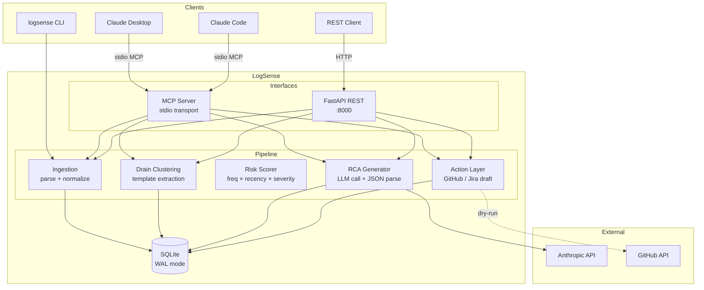

# LogSense

**AI agent for log ingestion, error clustering, and automated root cause analysis.**

[](https://github.com/pavankumarale/logsense/actions/workflows/ci.yml)
[](https://python.org)
[](LICENSE)

---

## What it does

LogSense ingests raw application logs (Spring Boot, Nginx, JSON, syslog),
clusters similar errors using the Drain template-extraction algorithm, assigns
a risk score to each cluster, and calls an LLM (Claude) to generate a
plain-language root cause hypothesis with a concrete next action.

The result can be surfaced as a structured GitHub issue, a Jira payload, or
fed back into Claude directly via an MCP server — enabling an AI agent to
diagnose and escalate incidents autonomously.

```
Raw logs → Parse → Cluster → Score → LLM RCA → GitHub Issue / Jira ticket
                                              ↕
                               Claude Desktop / Claude Code (via MCP)
```

---

## Why this exists

I've built production versions of this class of system — a log-mining and
test-gap-analysis agent, an LLM-driven RCA pipeline, and MCP integrations
with Splunk, Jira, Confluence, and Bitbucket. This project is a legally-clean,
public demonstration of the same patterns, written to be read by engineers
who want to understand how these systems are actually structured.

The interesting engineering decisions are in the ADRs:
- [Why Drain over embeddings](docs/adr/0001-clustering-approach.md) — the
  case for deterministic, zero-dependency clustering in v1
- [Prompt design and confidence scoring](docs/adr/0002-llm-prompt-design-and-confidence-scoring.md)
  — how to get calibrated confidence out of an LLM without a second grader call
- [MCP as primary interface](docs/adr/0003-mcp-vs-rest-as-primary-interface.md)
  — why "AI-native" matters and what it means in practice

---

## Architecture



---

## Quick Start

### One-command Docker run

```bash
cp .env.example .env
# Add your ANTHROPIC_API_KEY to .env
docker compose up --build
```

API is available at `http://localhost:8000`. Interactive docs: `http://localhost:8000/docs`.

### Local development

```bash
git clone https://github.com/pavankumarale/logsense
cd logsense
python -m venv .venv && source .venv/bin/activate
pip install -e ".[dev]"
cp .env.example .env   # fill in ANTHROPIC_API_KEY
make demo              # end-to-end demo with fixture logs
```

### Run the test suite

```bash
make test              # unit + integration (mocked LLM, no API key needed)
make test-live         # real LLM calls — requires ANTHROPIC_API_KEY
```

---

## MCP Server (Claude Desktop / Claude Code)

LogSense exposes its pipeline as four MCP tools:

| Tool | What it does |
|---|---|
| `ingest_logs` | Parse raw log content and store normalized entries + clusters |
| `get_clusters` | Return error clusters ranked by risk score |
| `get_rca_for_cluster` | Run LLM root cause analysis for a specific cluster |
| `draft_incident_report` | Build a GitHub issue or Jira payload (dry-run by default) |

Add to `~/.claude_desktop_config.json`:

```json
{
  "mcpServers": {
    "logsense": {
      "command": "python",
      "args": ["-m", "logsense.mcp_server.server"],
      "cwd": "/path/to/logsense",
      "env": {
        "ANTHROPIC_API_KEY": "sk-ant-your-key-here",
        "LOGSENSE_DB_PATH": "/path/to/logsense.db"
      }
    }
  }
}
```

Full setup guide: [docs/mcp-connection-guide.md](docs/mcp-connection-guide.md)

---

## CLI Usage

```bash
# Ingest logs from a file
logsense ingest path/to/app.log

# Show clusters ranked by risk score
logsense triage --limit 10

# Run LLM RCA on a cluster
logsense rca <cluster-id>

# Draft a GitHub issue (dry-run)
logsense draft <cluster-id> --platform github

# Start the REST API server
logsense serve
```

---

## REST API

```bash
# Ingest logs
curl -X POST http://localhost:8000/api/v1/ingest \
  -H "Content-Type: application/json" \
  -d '{"content": "2024-01-15 10:23:45.123 ERROR [payment-service] - DB timeout"}'

# List clusters
curl http://localhost:8000/api/v1/triage/clusters?min_risk_score=0.5

# Generate RCA
curl -X POST http://localhost:8000/api/v1/rca/cluster/<cluster-id>

# Draft incident report
curl -X POST http://localhost:8000/api/v1/rca/draft \
  -H "Content-Type: application/json" \
  -d '{"cluster_id": "<id>", "platform": "github", "dry_run": true}'
```

---

## Project Structure

```
logsense/
├── ingestion/        # Log parsers (Spring Boot, Nginx, JSON, syslog)
├── triage/           # Drain clustering + risk scoring
├── rca/              # LLM prompt templates and RCA generation
├── actions/          # GitHub issue and Jira payload builders
├── mcp_server/       # MCP server (FastMCP) — primary interface
├── api/              # FastAPI REST layer — mirrors MCP tools
└── storage/          # SQLite schema + async data access layer

tests/
├── unit/             # Parser, Drain, scorer — no I/O, no LLM
├── integration/      # Full pipeline with mocked LLM responses
└── fixtures/         # Synthetic Spring Boot, Nginx, JSON logs

docs/
├── architecture.md   # System diagram + data flow
├── LLD.md            # Low-level design: triage + RCA pipeline
└── adr/              # Architecture Decision Records
    ├── 0001-clustering-approach.md
    ├── 0002-llm-prompt-design-and-confidence-scoring.md
    └── 0003-mcp-vs-rest-as-primary-interface.md
```

---

## Configuration

All runtime behaviour is controlled via environment variables. See
[`.env.example`](.env.example) for the full list. Key settings:

| Variable | Default | Description |
|---|---|---|
| `ANTHROPIC_API_KEY` | — | Required for LLM RCA |
| `ANTHROPIC_MODEL` | `claude-sonnet-4-6` | Swap to any Claude model |
| `LOGSENSE_DRY_RUN` | `true` | Set `false` to actually post GitHub issues |
| `DRAIN_SIM_THRESHOLD` | `0.5` | Clustering sensitivity (lower = more merging) |
| `LOGSENSE_DB_PATH` | `logsense.db` | SQLite database path |

---

## Tech Stack

- **Python 3.11+**, **FastAPI**, **uvicorn** — REST layer
- **MCP Python SDK** (FastMCP) — MCP server
- **Anthropic SDK** — Claude API for RCA generation
- **aiosqlite** — async SQLite access
- **Drain algorithm** (custom implementation) — log clustering
- **pytest** — unit + integration tests (cassette-style mocking)
- **Docker + docker-compose** — one-command deployment
- **GitHub Actions** — CI with matrix testing on Python 3.11 + 3.12

---

## License

MIT. See [LICENSE](LICENSE).
