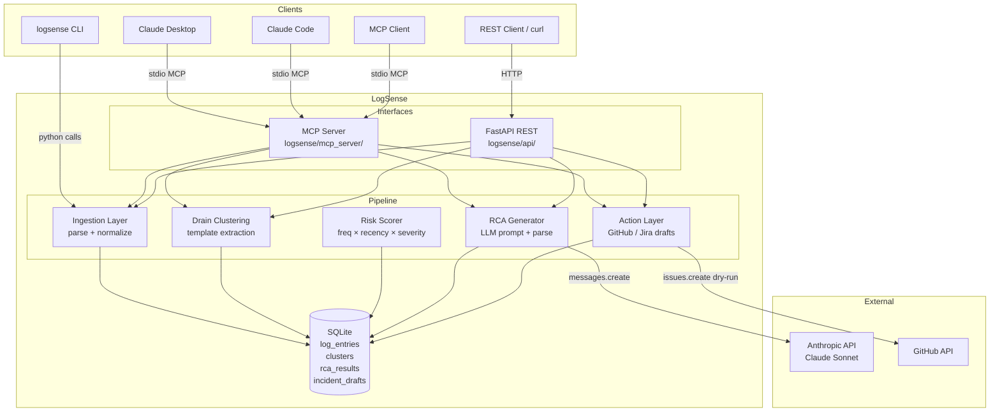

# LogSense — Architecture Overview

## System Diagram



## Data Flow

```
Raw logs (any format)
      │
      ▼ ingestion/parser.py (multi-format regex)
LogEntry[] — normalized schema: id, timestamp, level, service, message, stack_trace, trace_id
      │
      ▼ triage/drain.py (Drain algorithm)
LogGroup[] — template strings like "DB timeout after <*>ms"
      │
      ▼ triage/cluster.py + scorer.py
Cluster[] — template + count + risk_score (0..1)
      │
      ▼ storage/repository.py → SQLite
      │
      ▼ (on demand) rca/generator.py → Anthropic API
RCAResult — title, summary, hypothesis, confidence, action, service
      │
      ▼ (on demand) actions/github.py or actions/jira.py
IncidentDraft — issue payload (dry-run by default)
```

## Interface Layer

Both interfaces expose the same four operations:

| Operation | MCP tool | REST endpoint |
|---|---|---|
| Parse and store logs | `ingest_logs` | `POST /api/v1/ingest` |
| List clusters by risk | `get_clusters` | `GET /api/v1/triage/clusters` |
| Run LLM RCA | `get_rca_for_cluster` | `POST /api/v1/rca/cluster/{id}` |
| Draft incident report | `draft_incident_report` | `POST /api/v1/rca/draft` |

MCP is the primary interface (see ADR 0003). REST mirrors it for non-MCP clients.

## Key Design Decisions

- **Drain over embeddings** for clustering: deterministic, zero external deps,
  O(1) per log line. (ADR 0001)
- **Prompt-based JSON** for structured LLM output with explicit confidence rubric. (ADR 0002)
- **MCP as primary interface** because it enables AI-native tool use within LLM
  reasoning chains, not just passive API responses. (ADR 0003)
- **SQLite** for storage: zero infrastructure, `docker compose up` works instantly,
  WAL mode for concurrent reads.
- **Dry-run by default** for all external actions (GitHub, Jira) — explicit flag
  required to actually post.
